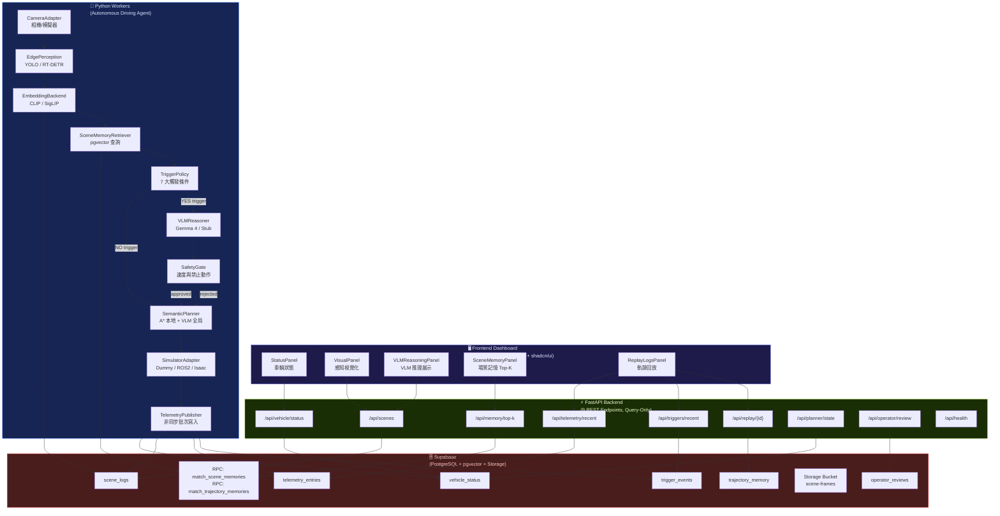
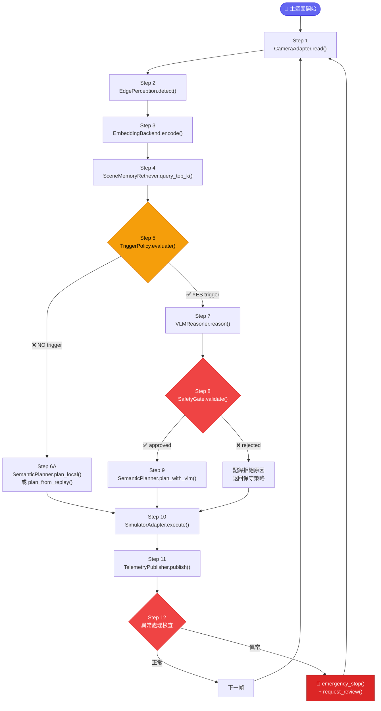
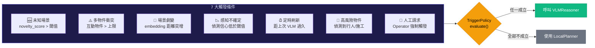
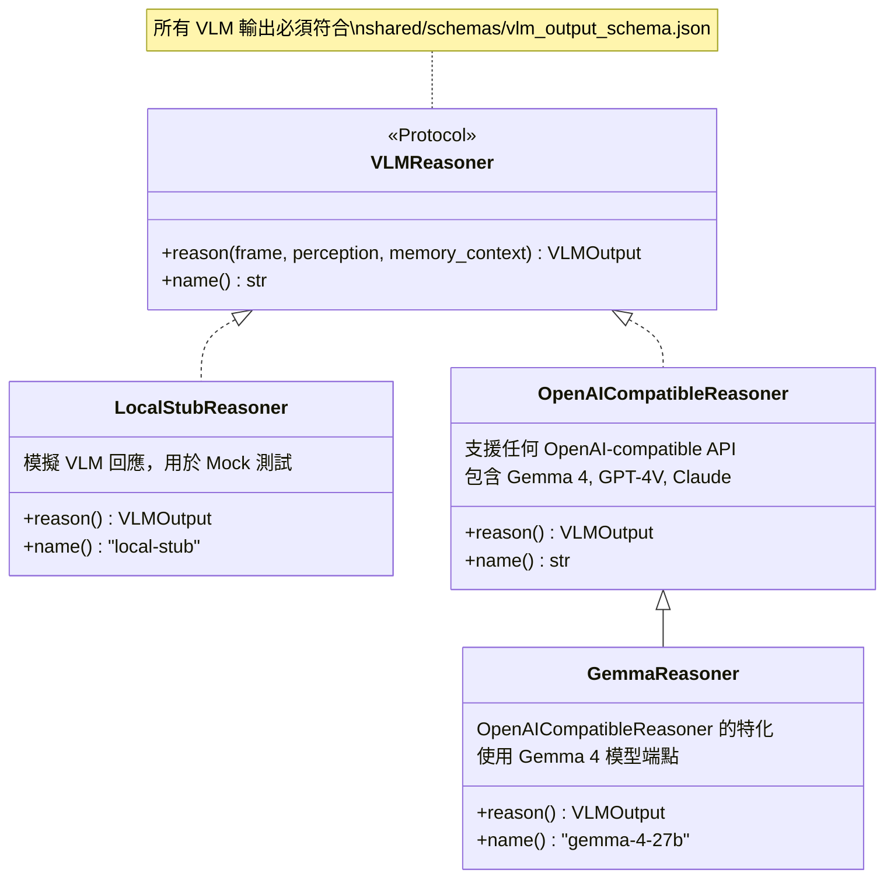
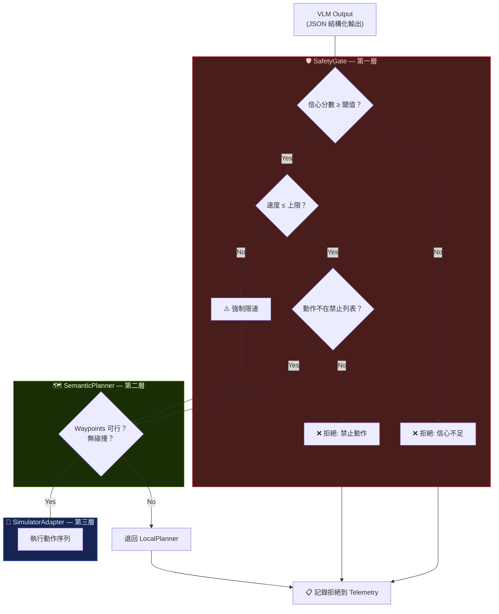
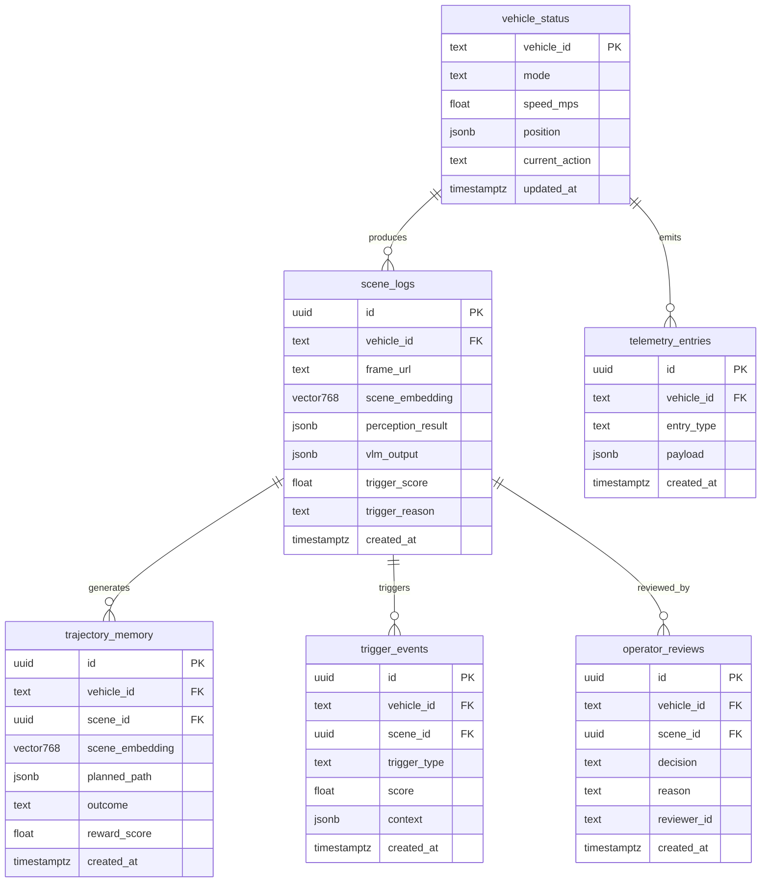
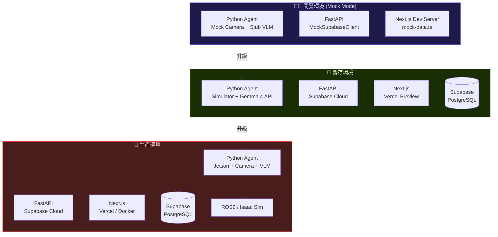

# MA-VLNA 系統架構圖

> Memory-Augmented Vision-Language Navigation Agent — 系統架構設計文件

---

## 系統總覽 Mermaid 圖

---

## Agent 12 步導航循環 (Main Loop)

---

## VLM 觸發條件 (Trigger Policy)

---

## VLM Reasoner 可替換架構

---

## 安全機制三層架構

---

## 資料流與儲存架構

---

## 部署拓撲

